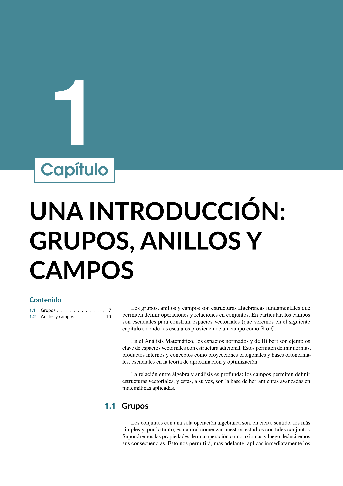
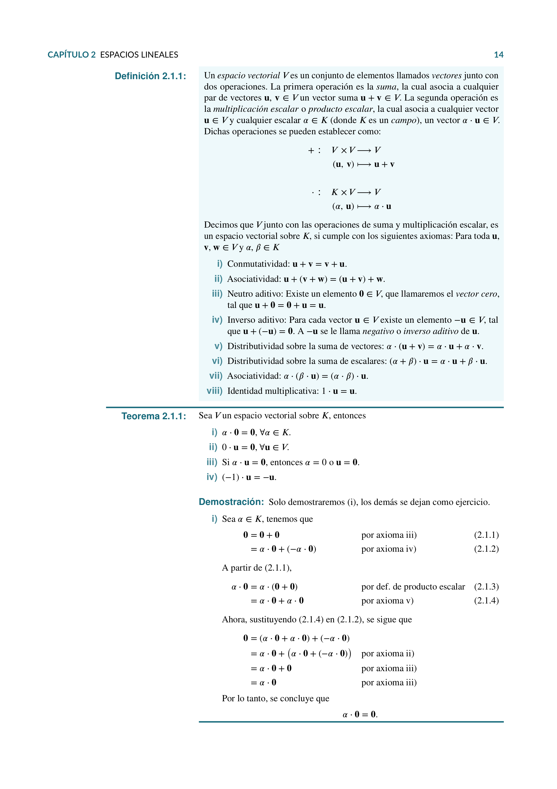

# Análisis Matemático

Este repositorio contiene el material y el código asociado al estudio de **Análisis Matemático**, diseñado para estudiantes de ingeniería matemática y profesionales interesados en espacios normados, espacios de Hilbert, aproximación vectorial e integración en el contexto de análisis funcional.

## Contenido

### Capítulo 1: Espacios Normados
1. **Definición de norma**: Concepto y propiedades.
2. **Ejemplos de normas**: Euclidiana, infinito y p-normas.
3. **Equivalencia de normas**: Criterios y aplicaciones.
4. **Subespacios y espacios normados**.
5. **Espacios normados completos**: Espacios de Banach.

### Capítulo 2: Espacios de Hilbert
1. **Definición de producto interno** y sus propiedades.
2. **Ejemplos de productos internos**.
3. **Teorema de proyección** en espacios de Hilbert.
4. **Complementos ortogonales y bases ortonormales**.
5. **Proceso de Gram-Schmidt** para ortonormalización.

### Capítulo 3: Aproximación con Métodos Vectoriales
1. **Ecuaciones normales y matrices de Gram**.
2. **Series de Fourier**: Definición y propiedades.
3. **Desigualdad de Bessel** y su interpretación.
4. **Sistemas ortonormales completos**.
5. **Aproximación con series de Fourier**.
6. **Problema de aproximación dual en optimización**.
7. **Distancia mínima en conjuntos convexos**.

### Capítulo 4: Integral de Lebesgue
1. **Construcción de la medida de Lebesgue**.
2. **Espacios medibles y funciones medibles**.
3. **Integral de funciones medibles**: Definición y comparación con la integral de Riemann.
4. **Funciones de clase \( L^2 \)** y normas asociadas.
5. **Desigualdades de Minkowski y Hölder**.

### Capítulo 5: Integral de Lebesgue-Stieltjes
1. **Definición de la integral de Lebesgue-Stieltjes**.
2. **Propiedades y aplicaciones de la integral**.
3. **Intercambio entre integración y diferenciación**.
4. **Diferenciación bajo el signo de integral**.

## Cómo usar
El material está disponible en formato **LaTeX** para facilitar su consulta y estudio. Puedes clonarlo o descargarlo para compilarlo en **Overleaf** o cualquier otro editor compatible con LaTeX.

## Descarga
Puedes descargar las notas haciendo clic en el enlace que se encuentra al inicio de este repositorio.

## Contribuciones
Si tienes sugerencias o mejoras, siéntete libre de abrir una *issue* o hacer un *pull request*. ¡Tu contribución es bienvenida!