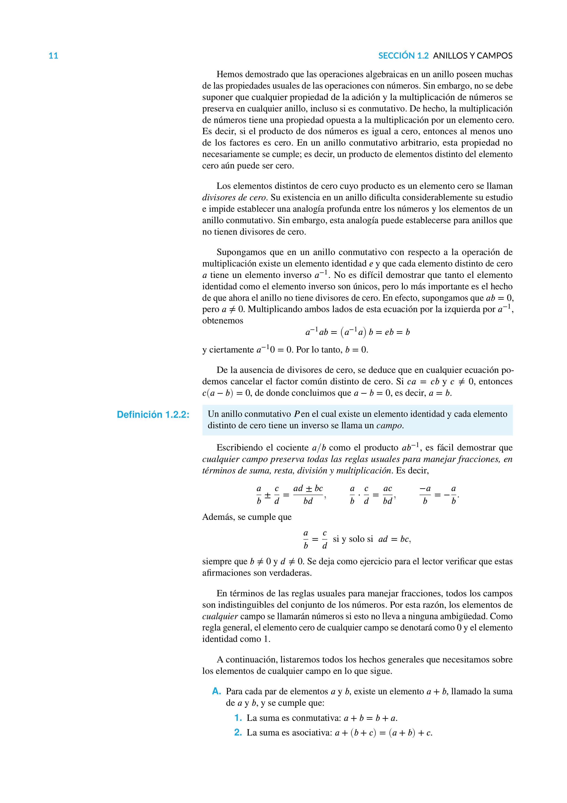

# Análisis Matemático

Este repositorio contiene el material y el código asociado al estudio de **Análisis Matemático**, diseñado para estudiantes de ingeniería matemática y profesionales interesados en álgebra abstracta, espacios vectoriales, espacios métricos, espacios con producto interno, y métodos de optimización en el contexto de análisis funcional.

## Contenido

### Capítulo 1: Grupos, Anillos y Campos
1. **Definición de grupo**: Propiedades y ejemplos.
2. **Anillos y campos**: Definición, propiedades y ejemplos.
3. **El campo de los números reales y complejos**: Estructura y aplicaciones.
4. **Ejercicios**: Ejercicios prácticos sobre grupos, anillos y campos.

### Capítulo 2: Espacios Vectoriales
1. **Definición de espacio vectorial**: Axiomas básicos y ejemplos.
2. **Subespacios vectoriales**: Propiedades y aplicaciones.
3. **Base y dimensión**: Cálculo y ejemplos.
4. **Espacios vectoriales reales y complejos**: Definición y ejemplos.
5. **Ejercicios**: Ejercicios prácticos sobre espacios vectoriales.

### Capítulo 3: Espacios Métricos
1. **Espacios vectoriales normados**: Definición y ejemplos.
2. **Espacios métricos y topología básica**: Conceptos fundamentales.
3. **Sucesiones**: Propiedades y teoremas relevantes.
4. **Ejercicios**: Ejercicios prácticos sobre espacios métricos.

### Capítulo 4: Espacios con Producto Interno
1. **Espacios con producto interno**: Definición y proyecciones.
2. **Proyecciones ortogonales**: Cálculo y aplicaciones.
3. **Teorema de proyección**: Teorema fundamental y aplicaciones.
4. **Bases ortonormales**: Conceptos y técnicas de ortonormalización.
5. **Ejercicios**: Ejercicios prácticos sobre espacios con producto interno.

### Capítulo 5: Optimización mediante Métodos Vectoriales
1. **Métodos de aproximación**: Series de Fourier y aplicaciones.
2. **Métodos de optimización**: Problemas de aproximación dual.
3. **Distancia mínima en conjuntos convexos**: Conceptos clave y ejemplos.
4. **Teoremas de optimización**: Aplicaciones en análisis funcional.
5. **Ejercicios**: Ejercicios prácticos sobre métodos de optimización.

## Cómo usar
El material está disponible en formato **LaTeX** para facilitar su consulta y estudio. Puedes clonarlo o descargarlo para compilarlo en **Overleaf** o cualquier otro editor compatible con LaTeX.

## Descarga
Puedes descargar las notas haciendo clic en el enlace que se encuentra al inicio de este repositorio.

## Contribuciones
Si tienes sugerencias o mejoras, siéntete libre de abrir una *issue* o hacer un *pull request*. ¡Tu contribución es bienvenida!